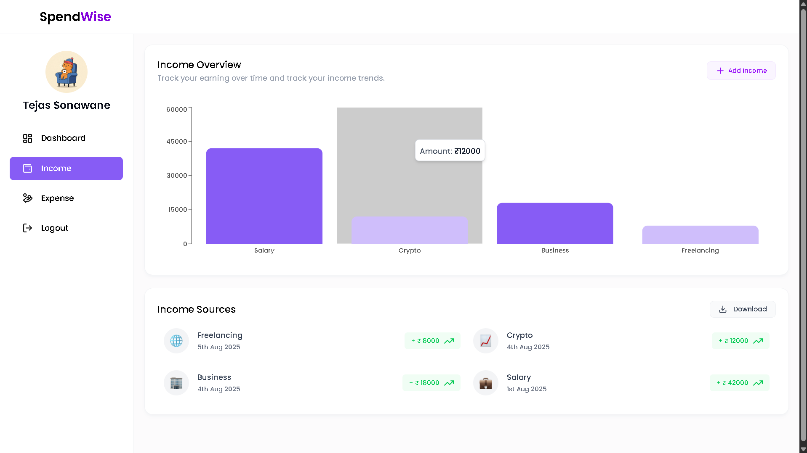

# SpendWise – MERN Expense Tracker

SpendWise is a full-stack MERN application for tracking income and expenses, visualizing financial data, and managing personal finances with ease. It features secure authentication, interactive dashboards, Excel export, and a modern, responsive UI.

## Features

1. **User Authentication**  
   Secure sign-up and login using JWT. User sessions are protected and persisted.

2. **Dashboard Overview**  
   View total balance, income, and expenses in summary cards, with recent transactions and financial charts.

3. **Income Management**  
   - Add, view, and delete income sources.
   - Download all income data as an Excel file.

4. **Expense Management**  
   - Add, view, and delete expenses with category-based tracking.
   - Download all expense data as an Excel file.

5. **Interactive Charts**  
   Visualize income and expenses with Bar, Pie, and Line charts for better insights.

6. **Recent Transactions**  
   Quickly access the latest income and expense records.

7. **Reports**  
   Export income and expense data to Excel for offline analysis.

8. **Mobile Responsive UI**  
   Works seamlessly across desktops, tablets, and mobile devices.

9. **Intuitive Navigation**  
   Sidebar menu for easy access to Dashboard, Income, Expenses, and Logout.

10. **Quick Delete**  
    Hover over income/expense cards to reveal a delete button for easy removal.

---

## Tech Stack

- **Frontend:** React, Vite, Tailwind CSS, Recharts, Axios, React Router, Emoji Picker  
- **Backend:** Node.js, Express, MongoDB, Mongoose, JWT, Multer, XLSX  
- **Authentication:** JWT (JSON Web Tokens)  
- **File Uploads:** Multer (for profile images)  
- **Excel Export:** XLSX

---

## Project Structure

```
backend/
  config/
  controller/
  middlewares/
  models/
  routes/
  uploads/
  .env.example
  server.js

frontend/
  expense-tracker/
    src/
      components/
      context/
      hooks/
      pages/
      utils/
    index.html
    package.json
```

---

## Getting Started

### Prerequisites

- Node.js & npm
- MongoDB database

### Backend Setup

1. **Install dependencies:**
   ```sh
   cd backend
   npm install
   ```

2. **Configure environment variables:**  
   Copy `.env.example` to `.env` and fill in your MongoDB URI and JWT secret.

3. **Start the backend server:**
   ```sh
   npm run dev
   ```
   The backend runs on `http://localhost:8000` by default.

### Frontend Setup

1. **Install dependencies:**
   ```sh
   cd frontend/expense-tracker
   npm install
   ```

2. **Start the frontend:**
   ```sh
   npm run dev
   ```
   The frontend runs on `http://localhost:5173` by default.

---

## Usage

- **Sign Up / Login:**  
  Create an account or log in with your credentials.

- **Dashboard:**  
  View your financial summary, recent transactions, and charts.

- **Add Income/Expense:**  
  Use the forms to add new income sources or expenses. Optionally, pick an emoji icon.

- **Delete:**  
  Hover over a transaction card to reveal the delete button.

- **Export:**  
  Download your income or expense data as Excel files.

- **Profile Image:**  
  Upload a profile picture during sign-up.

---

## Environment Variables

Backend `.env` example:
```
MONGO_URI=your_mongodb_connection_string
JWT_SECRET=your_jwt_secret
PORT=8000
CLIENT_URL=http://localhost:5173
```

---

## Screenshots

### Auth pages
 


### Dashboard pages
#### dashboard

#### income

#### expense


---

## License

MIT

---

## Acknowledgements

- [React](https://react.dev/)
- [Vite](https://vitejs.dev/)
- [Tailwind CSS](https://tailwindcss.com/)
- [Recharts](https://recharts.org/)
- [Express](https://expressjs.com/)
- [MongoDB](https://www.mongodb.com/)
- [Mongoose](https://mongoosejs.com/)
- [JWT](https://jwt.io/)
- [Multer](https://github.com/expressjs/multer)
- [XLSX](https://github.com/SheetJS/sheetjs)

---

## Contributing

Pull requests are welcome! For major changes, please open an issue first to discuss what you would like to change.

---

**SpendWise –